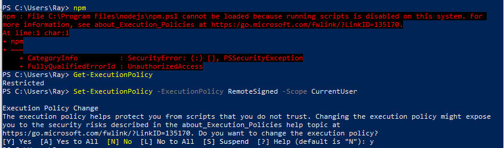
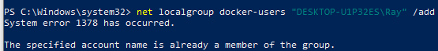

<br/>

## **Prerequisites**

Before proceeding with the installation, ensure you have the following set up:

✅ **Git Installed** – Download and install Git from: [Git Official Site](https://git-scm.com/downloads)

✅ **Git-Based Terminal Configured in Your IDE** – Use **Git Bash, WSL, or a terminal with Git support**.

💡 **Why?**

- Xest requires a Git-based terminal due to its reliance on `grep`.
- Some installations may require Git for dependency management.

To verify Git installation, run:

```sh
git --version
```

If Git is installed correctly, it will return the version number.

<br/>

## **1. Install NVM (Node Version Manager)**

#### **Step 1: Download and Install NVM for Windows**

NVM for Windows is different from the Linux version. Follow these steps:

- Download the latest NVM for Windows installer from the official repository: [NVM for Windows GitHub Releases](https://github.com/coreybutler/nvm-windows/releases).
- Run the installer (`nvm-setup.exe`) and follow the installation instructions.
- Restart your system after installation.

#### **Step 2: Verify Installation**

Open **PowerShell** or **Command Prompt** and run:

```sh
nvm version
```

If installed correctly, it will return the version number.
&nbsp;

#### **Step 3: Install Node.js**

To install the latest version of Node.js, run:

```sh
nvm install latest  
nvm use latest
```

To verify the installation, run:

```sh
node -v  
npm -v
```

#### **📌 If you encounter issues running `npm -v`, try the following steps**  



- **Open PowerShell as Administrator:**
  - Right-click on the Start menu and select **"Windows PowerShell (Admin)"**.
  - OR, search for **PowerShell**, right-click it, and choose **"Run as Administrator"**.

- **Check your current execution policy (optional):**

   ```sh
   Get-ExecutionPolicy
   ```

- **Change the execution policy:**
  - **For this session only (temporary):**

     ```sh
     Set-ExecutionPolicy -ExecutionPolicy RemoteSigned -Scope Process
     ```

  - **To change the policy system-wide (more permanent, but still reversible):**

     ```sh
     Set-ExecutionPolicy -ExecutionPolicy RemoteSigned -Scope CurrentUser
     ```

   This will allow locally created scripts to run, but remote scripts will need to be signed by a trusted publisher.

  - **Try running npm again:**

     ```sh
     npm -v
     ```

- **If the issue persists, open a new PowerShell window using:**

   ```sh
   powershell -ExecutionPolicy RemoteSigned
   ```

<br/>

## **2. Install Docker**

#### **Step 1: Download and Install Docker Desktop**

- Download Docker Desktop for Windows from: [Docker Official Site](https://www.docker.com/products/docker-desktop).
- Run the installer and follow the setup instructions.
- Enable **Windows Subsystem for Linux (WSL 2) integration** if prompted.
- Restart your system after installation.

#### **Step 2: Verify Docker Installation**

Run the following command in **PowerShell**:

```sh
docker --version
```

<br/>

## **3. Install Docker Compose**

By default, **Docker Compose** is included with Docker Desktop. To verify:

```sh
docker compose version
```

<br/>

## **4. Allow Managing Docker as a Non-Admin User**

Docker Desktop automatically manages permissions, but if you encounter **permission issues**, follow these steps:

#### **Step 1: Run PowerShell as Administrator**

#### **Step 2: Verify your username and domain**

To confirm your username and domain, run:

```sh
[System.Security.Principal.WindowsIdentity]::GetCurrent().Name
```

**Note:** This will return the username in the format `DOMAIN\Username`. Make sure to replace `DOMAIN\Username` in the command below if needed.

#### **Step 3: Add your user to the `docker-users` group**

```sh
net localgroup docker-users "%USERDOMAIN%\%USERNAME%" /add
```



Sometimes you might receive an error stating that your user is already a member. This can be ignored.

#### **Step 4: Restart Your Computer**

For the changes to take effect, restart your system.

<br/>

## **5. Install Xest**

#### **Step 1: Install Xest CLI**

Run the following command in **PowerShell**:

```sh
npm install -g xest
```

#### **Step 2: Bootstrap Your API**

Run the following command in a **Bash terminal** because of its dependency on `grep`:

```sh
xx [project-name]
```

Navigate into the newly created directory:

```sh
cd project-name
```

#### **Step 3: Start Your Xest API**

Run:

```sh
xx run
```